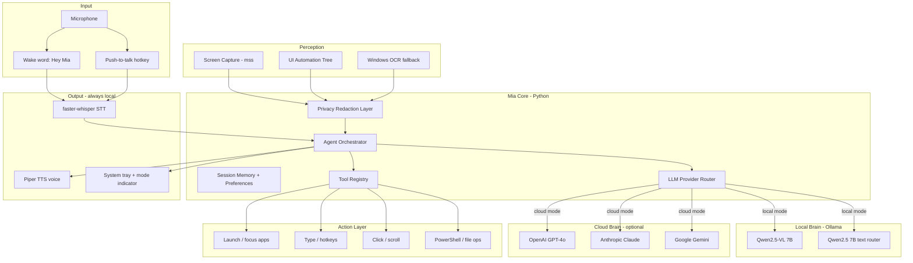

# Mia — Local JARVIS for Windows

## Is this actually possible?

**Yes, for personal use — with realistic expectations.** You can get very close to the JARVIS *feel* (voice in, sees screen, executes commands, speaks back), but not Hollywood-level fluidity.

| Capability | Feasibility | Notes |
|---|---|---|
| See & understand screen | High | Local VLM (Qwen2.5-VL via Ollama) reads UI, text, windows |
| Voice commands | High | Custom wake word + faster-whisper + Piper TTS |
| Open apps, type, click | High | UI Automation + SendInput; works best on standard Windows apps |
| Multi-step automation | Medium–High | Local: slower, more errors; cloud mode: much stronger multi-step reasoning |
| Always-on, low latency | Medium | Local: 2–8s/turn; cloud mode: ~1–3s/turn with better accuracy |
| Games / DRM / UAC dialogs | Low | Protected content, anti-cheat, secure desktop block automation |
| Fully autonomous “do my work” | Low | Works for repetitive tasks; unreliable for novel complex workflows |

**Windows limits you can relax (personal PC only):**
- Run Mia **elevated (Admin)** for broader control
- Add a **Defender exclusion** for the Mia folder (automation libs trigger false positives)
- Lower UAC or pre-approve known actions
- Disable focus-assist / do-not-disturb interference during automation
- Use **UI Automation tree first**, vision second — much faster and more reliable than pure screenshot clicking

---

## Privacy vs performance modes

Mia is **local-first by default**. You can opt into cloud AI when you want faster responses, stronger reasoning, or more reliable multi-step automation — at the cost of sending screenshots and context to a third-party API.

| Mode | Privacy | Speed | Reasoning | When to use |
|---|---|---|---|---|
| **local** (default) | Highest — nothing leaves your PC | 2–8s/turn | Good for simple tasks | Daily driver, sensitive screens |
| **cloud** | Lower — screenshots + UI tree sent to API | ~1–3s/turn | Best — GPT-4o / Claude / Gemini class | Complex automation, coding help, multi-step workflows |
| **auto** | Mixed — routes per request | Varies | Smart routing | Best of both: simple commands stay local, hard tasks go cloud |

**Switching modes:**
- Config file: `llm.mode: local | cloud | auto` in `mia.yaml`
- System tray menu: toggle mode with a visual indicator (green = local, amber = cloud)
- Voice command: *"Mia, use cloud mode"* / *"Mia, go local"*
- Per-request override: *"Mia, use cloud for this one"* (single turn, then revert)

**What stays local even in cloud mode:**
- Wake word detection, microphone audio, STT (faster-whisper), TTS (Piper)
- Action execution (clicks, typing, app launches) — never outsourced
- Audit logs and session memory on disk

**What goes to the cloud in cloud mode:**
- Screenshot (downscaled JPEG)
- UI Automation tree summary (element names, types — no raw pixel data beyond screenshot)
- User transcript + conversation history for the current session
- Tool call results (e.g. "clicked Submit button")

**Privacy safeguards (cloud mode):**
- **Redaction layer:** strip password fields, credit card patterns, and known sensitive window titles (banking, password managers) from UI tree before upload; blur or block screenshot if focused window matches a blocklist
- **Confirm prompt:** first time cloud mode is enabled, Mia speaks: *"Cloud mode active — screen content will be sent to [provider]. Say 'go local' to disable."*
- **Tray indicator:** persistent amber dot when cloud is active so it's never silent
- **API keys:** stored in `%USERPROFILE%\.mia\secrets.env`, never in git
- **No training opt-out:** use provider APIs with data retention disabled where supported (OpenAI API default, Anthropic API default)

**Recommended cloud providers (pick one or configure fallback chain):**

| Provider | Vision model | Strengths |
|---|---|---|
| OpenAI | `gpt-4o` | Fast, strong tool use, good vision |
| Anthropic | `claude-sonnet-4-20250514` | Best reasoning, careful with instructions |
| Google | `gemini-2.0-flash` | Fast, cheap, good vision |

All three support native function/tool calling — critical for the agent loop.

---

## Recommended stack



**Language:** Python 3.11+ (best Windows automation ecosystem, fast iteration)

**Key dependencies:**
- [Ollama](https://ollama.com) — `qwen2.5vl:7b` (default local brain; use `:3b` if VRAM is tight)
- [openai](https://github.com/openai/openai-python) / [anthropic](https://github.com/anthropics/anthropic-sdk-python) / [google-genai](https://github.com/googleapis/python-genai) — optional cloud providers
- [faster-whisper](https://github.com/SYSTRAN/faster-whisper) — local STT
- [Piper](https://github.com/rhasspy/piper) — local TTS (pick a calm British/male voice for JARVIS vibe)
- [openWakeWord](https://github.com/dscripka/openWakeWord) — train custom **"hey mia"** model (Colab notebook or `livekit-wakeword`)
- [uiautomation](https://github.com/yinkaisheng/Python-UIAutomation-for-Windows) + [pywinauto](https://github.com/pywinauto/pywinauto) — UI tree + control
- [mss](https://github.com/BoboTiG/python-mss) — fast screen capture
- [keyboard](https://github.com/boppreh/keyboard) — global hotkeys (push-to-talk, kill switch)
- [pystray](https://github.com/moses-palmer/pystray) — system tray presence

**Optional second model:** A text-only `qwen2.5:7b` for quick routing ("open Chrome" doesn't always need a screenshot).

---

## Hardware baseline

| Tier | GPU VRAM | Local models | Expected feel (local mode) |
|---|---|---|---|
| Minimum | 8 GB | `qwen2.5vl:3b`, whisper small | Usable but sluggish (~5–10s turns) |
| Recommended | 12 GB+ | `qwen2.5vl:7b`, whisper medium | Good daily driver (~2–5s turns) |
| Ideal | 16 GB+ | 7B VLM + separate 7B router | Snappier routing, better multi-step |
| Cloud mode | Any GPU | None required for brain | ~1–3s turns; GPU only used for STT if CUDA-enabled |

RAM: 16 GB minimum, 32 GB recommended (models + Windows + apps). Cloud mode works even on machines without a discrete GPU.

---

## Project structure (greenfield — [c:\OblivionX\Projects\Personal\Mia](c:\OblivionX\Projects\Personal\Mia))

```
Mia/
├── pyproject.toml
├── config/
│   ├── mia.yaml              # hotkeys, model names, voice, llm.mode
│   └── sensitive_apps.yaml   # window titles to block/redact in cloud mode
├── src/mia/
│   ├── __main__.py           # entry: python -m mia
│   ├── app.py                # lifecycle, tray, hotkeys, mode toggle
│   ├── core/
│   │   ├── agent.py          # tool-calling loop
│   │   ├── prompts.py        # Mia personality + system prompt
│   │   └── memory.py         # short-term conversation context
│   ├── llm/
│   │   ├── base.py           # abstract LLMProvider interface
│   │   ├── router.py         # local / cloud / auto routing logic
│   │   ├── ollama_client.py  # local chat + vision
│   │   ├── openai_client.py  # optional cloud
│   │   ├── anthropic_client.py
│   │   └── gemini_client.py
│   ├── privacy/
│   │   └── redaction.py      # strip sensitive fields before cloud upload
│   ├── voice/
│   │   ├── wake_word.py
│   │   ├── stt.py            # faster-whisper streaming
│   │   └── tts.py            # Piper playback queue
│   ├── perception/
│   │   ├── screen.py         # capture active monitor/window
│   │   └── accessibility.py  # UI tree snapshot as JSON
│   ├── actions/
│   │   ├── executor.py       # validates + runs tool calls
│   │   ├── apps.py           # launch, focus, close
│   │   ├── input.py          # type, click, hotkey
│   │   └── shell.py          # safe PowerShell commands
│   └── tools/
│       └── registry.py       # tool schemas for the agent
├── models/
│   └── hey_mia.onnx          # custom wake word (trained once)
├── scripts/
│   ├── setup.ps1             # Ollama pull, Piper voice, Defender exclusion
│   └── train_wakeword.md     # steps to create "hey mia"
└── logs/                     # action audit log
```

---

## Agent design (how Mia thinks)

Mia uses a **ReAct-style tool loop** — not one-shot answers:

1. User speaks → STT transcript
2. Gather context: active window title, UI tree summary, optional screenshot
3. **Provider router** picks local Ollama or cloud API based on `llm.mode` (and complexity heuristics in `auto` mode)
4. **Redaction layer** sanitizes context if cloud mode (strip passwords, block sensitive apps)
5. Send to chosen provider with tool definitions (native tool calling on cloud; JSON-mode on local)
6. Execute one tool → capture result → feed back to model
7. Repeat until `respond()` tool (TTS reply) or max steps
8. Speak response via Piper (always local)

**Auto-routing heuristics** (when `llm.mode: auto`):
- Stay **local** for: simple commands ("open Chrome", "type hello", "what time is it"), no screenshot needed
- Escalate to **cloud** for: multi-step requests ("fill out this form", "debug this error"), screenshot analysis, or when local model fails/confidence is low
- User can force either mode per request via voice override

**Initial tool set (Phase 3–4):**

| Tool | Purpose |
|---|---|
| `respond(text)` | Speak to user |
| `launch_app(name)` | Start Menu / known paths |
| `focus_window(title)` | Bring window to front |
| `type_text(text)` | Keyboard input to focused field |
| `hotkey(keys)` | Ctrl+C, Alt+Tab, etc. |
| `click_element(name)` | Via UI Automation (preferred) |
| `click_coords(x, y)` | Vision fallback only |
| `read_screen()` | Refresh screenshot + tree |
| `run_powershell(cmd)` | Files, system queries (allowlist) |
| `wait(seconds)` | Pause for app load |

**Mia personality** (in `prompts.py`): concise, proactive, slightly formal — "At your service" energy without roleplay bloat. Always confirm before destructive actions (delete, shutdown, send message).

**Safety even for personal use:**
- **Kill switch:** `Ctrl+Shift+Pause` → immediately stop all input injection
- **Confirm mode:** destructive tools require spoken "yes" confirmation
- **Audit log:** every action logged to `logs/actions.jsonl`

---

## Windows integration details

**Screen capture:** Use `mss` on the monitor where the active window lives. Downscale to 1280px wide before sending to VLM (speed + VRAM).

**UI Automation first:** Export focused window controls as compact JSON (name, type, bounds, value). The model clicks by **element name**, not guessed coordinates — far more reliable.

**Elevation:** Ship a `scripts/run_admin.ps1` that relaunches Mia elevated. Needed for some system apps and consistent SendInput.

**Startup:** Optional Task Scheduler entry to start Mia at login (tray icon, wake word armed).

**Push-to-talk:** Default `Right Ctrl` hold-to-talk (configurable in `mia.yaml`). Wake word runs in parallel.

---

## Phased build plan

### Phase 0 — Environment (Day 1)
- Init Python project with `pyproject.toml`, git, `.gitignore`
- Install Ollama + pull `qwen2.5vl:7b` and `qwen2.5:7b`
- Install Piper voice model + faster-whisper model
- Train/download **"hey mia"** wake word ONNX
- `setup.ps1`: Defender exclusion, verify GPU in Ollama

**Milestone:** `ollama run qwen2.5vl:7b` + screenshot → describes your desktop.

### Phase 1 — Voice shell (Days 2–3)
- Wake word listener → beep/chime on activation
- Push-to-talk hotkey path (same STT pipeline)
- faster-whisper transcription
- Piper speaks a test phrase
- System tray: idle / listening / thinking / acting states

**Milestone:** Say "Hey Mia" → ask "what time is it" → spoken answer (no screen yet).

### Phase 2 — Screen understanding (Days 4–5)
- Screen capture + UI tree on demand
- Local Ollama vision: "describe what I'm doing" / "what app is focused"
- No actions yet — Q&A only

**Milestone:** "Hey Mia, what's on my screen?" → accurate description of active window.

### Phase 2b — Cloud mode (Days 5–6)
- `LLMProvider` abstract interface + Ollama implementation (refactor from Phase 2)
- OpenAI client (GPT-4o vision + tool calling) as first cloud provider
- `llm.mode` config: `local | cloud | auto`
- Privacy redaction layer + sensitive app blocklist
- Tray menu mode toggle + amber/green indicator
- Voice commands: "use cloud mode" / "go local"
- API key setup via `scripts/setup_cloud.ps1` → `%USERPROFILE%\.mia\secrets.env`

**Milestone:** Toggle to cloud mode → same "what's on my screen?" question returns faster, more detailed answer. Toggle back to local — no API calls made.

**Config example** (`config/mia.yaml`):
```yaml
llm:
  mode: local          # local | cloud | auto
  local:
    provider: ollama
    vision_model: qwen2.5vl:7b
    text_model: qwen2.5:7b
  cloud:
    provider: openai   # openai | anthropic | gemini
    model: gpt-4o
    # api_key loaded from ~/.mia/secrets.env
  auto:
    cloud_threshold: complex   # route multi-step + vision-heavy to cloud
```

### Phase 3 — Basic actions (Days 6–8)
- Tool registry + executor with kill switch
- `launch_app`, `type_text`, `hotkey`, `focus_window`
- Agent loop wired end-to-end

**Milestone:** "Open Notepad and type hello world" works reliably.

### Phase 4 — Reliable automation (Days 9–14)
- UI Automation click/focus by element name
- Multi-step loop with post-action verification screenshot
- PowerShell allowlist (list dir, open file, system info)
- Session memory (last N turns)
- Auto-routing: complex multi-step tasks prefer cloud when `mode: auto`
- Add Anthropic + Gemini as additional cloud providers (fallback chain)

**Milestone:** "Find the error in this window and copy it to clipboard" — works reliably in cloud mode; acceptable in local mode.

### Phase 5 — JARVIS polish (ongoing)
- Custom Piper voice tuning / optional voice clone
- Proactive mode (optional): periodic check when idle — "You have a meeting in 5 minutes"
- App-specific shortcuts (browser, VS Code, Spotify)
- Floating minimal overlay showing Mia's state
- Fine-tune wake word with your room audio (reduce false triggers)

---

## What will NOT feel like the movies (set expectations)

- **Latency (local):** Local VLM inference takes seconds; conversation won't feel instant — use cloud mode when speed matters
- **Privacy (cloud):** Screenshots leave your PC; redaction helps but isn't perfect — don't use cloud mode on banking/medical screens
- **API cost (cloud):** GPT-4o vision calls cost ~$0.01–0.05 per turn depending on screenshot size; fine for personal use, adds up if always-on
- **Games / custom UIs:** Vision-only clicking is fragile; stick to desktop apps
- **UAC / login screens:** Cannot automate without disabling security
- **Background awareness:** Continuous screen watching burns GPU (local) or API budget (cloud); use on-demand + idle polling instead
- **Complex reasoning (local):** 7B local model makes mistakes; switch to cloud or use `auto` mode for hard tasks

Local mode = private, free, slower. Cloud mode = faster, smarter, costs money and sends screen data. `auto` mode = sensible default once both are wired up.

---

## First commands to implement (priority order)

1. Open / close / focus applications
2. Type dictated text (your "audio to text typing" request)
3. Read and summarize screen content
4. File explorer operations (open folder, search)
5. Browser: open URL, search
6. System: volume, brightness, screenshot
7. Multi-step: "fill this form with …"

---

## Risk notes (personal PC)

- Running elevated + input simulation is powerful — keep kill switch always active
- Back up before granting Mia file-delete or shell tools
- Don't automate banking/password fields without explicit confirm mode
- Anti-cheat games may ban input simulation — exclude game executables from automation
- In cloud mode, review `sensitive_apps.yaml` blocklist regularly; when in doubt, say "go local" before handling sensitive screens
